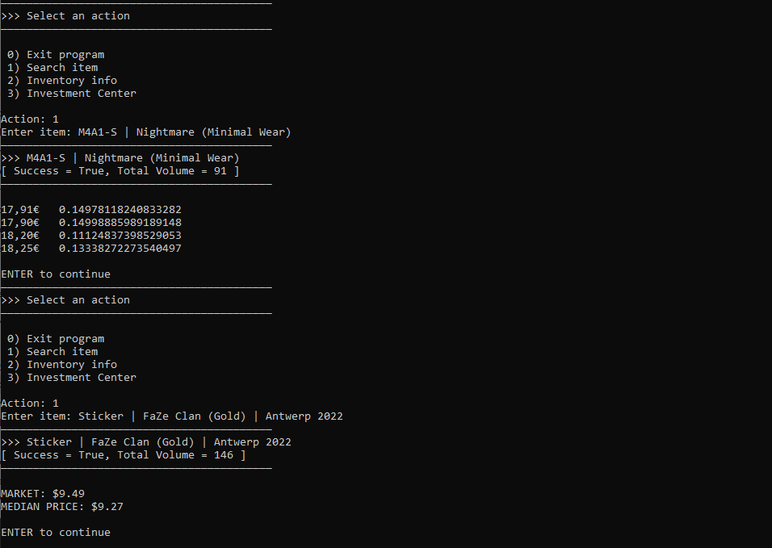

# steam-scraper
This is a simple web scraper I designed in Python to track item prices, investments, and collect CS:GO inventory data.

Example run of searching item prices:

Note: Certain features may result in errors due to outdated API calls (program written in 2020)
